# Poulpe firmware stack 

   

<a href="https://github.com/pollen-robotics/elec_Poulpe">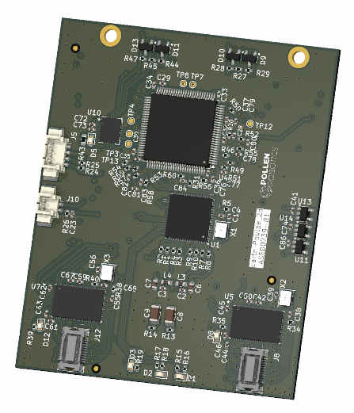</a>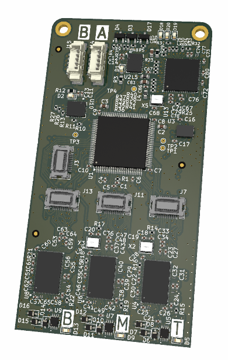</a>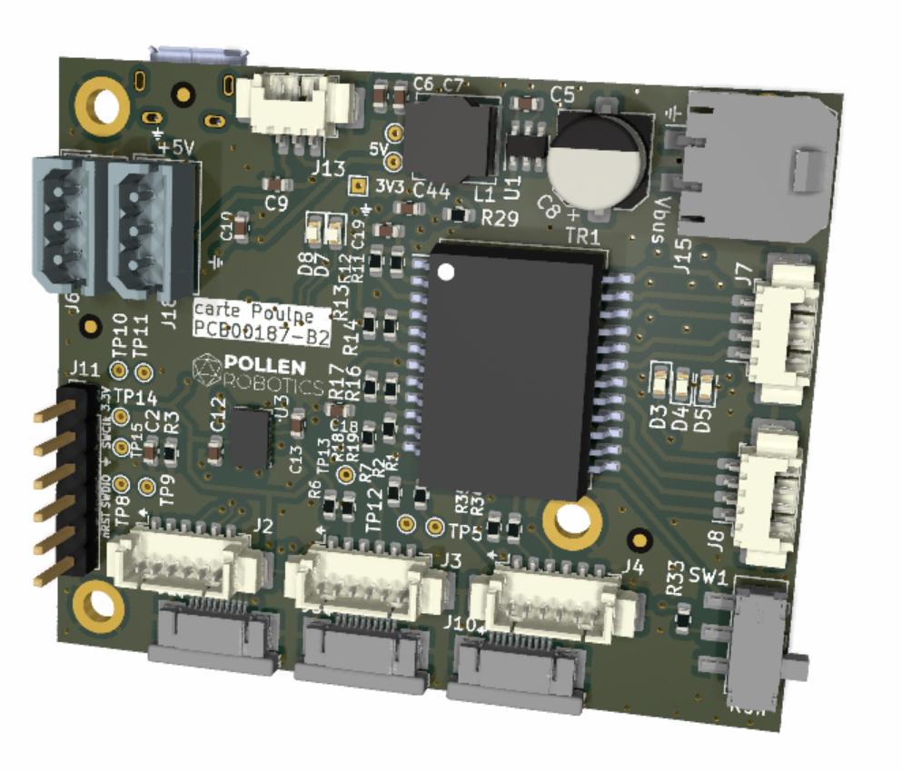</a>


A complete firmware stack for the **Poulpe** boards in combination with **Venouse** boards, using the Rust programming language and the [Embassy-rs](https://github.com/embassy-rs/embassy) framework. The firmware is designed to work with the Orbita2d and Orbita3d actuator setups. 


## Table of contents

- [Installation](#installation-and-pre-requisites)
    - [Rust and probe-rs installation](#rust-and-probe-rs-installation)
    - [Bootloader installation](#bootloader-installation)
- [Build and program](#build-and-program)
    - [Run/Fash](#runflash)
    - [USB Stlink](#usb-stlink)
    - [EtherCAT firmware update (FoE)](#ethercat-firmware-update-foe)
- [Firmware architecture](#firmware-architecture)
    - [Firmware real-time tasks](#firmware-real-time-tasks)
    - [Orbita2d architecture](#orbita2d-architecture)
    - [Orbita3d architecture](#orbita3d-architecture)
- [Firmware configuration](#firmware-configuration)
    - [Main features](#main-features)
    - [All features](#all-features)
    - [Axis absolute zeros configuration](#axis-absolute-zeros-configuration)
    - [EtherCAT configuration](#ethercat-configuration)
- [Safety features](#safety-features)
- [Firmware state machine](#firmware-state-machine)
- [LED blinking patterns](#led-blinking-patterns)
- [Related repositories](#related-repositories)

## Installation and Pre-requisites

In order to build and flush this firmware to the boards there are two main pre-requisites:

- Rust toolchain installed on your computer
- `bootloader_Pouple` already flushed to the board - [see the bootloader repo](https://github.com/pollen-robotics/bootloader_Poulpe)

## Rust and probe-rs installation

- `rustup default nightly`
- `rustup update`
- `rustup target add thumbv7em-none-eabihf`
- `cargo install probe-rs --features cli`
- Setup the st-link v2 device permisions: [more info in probe docs](https://probe.rs/docs/getting-started/probe-setup/)
(You might want to install probe-rs v0.21.1: `curl --proto '=https' --tlsv1.2 -LsSf https://github.com/probe-rs/probe-rs/releases/download/v0.21.1/probe-rs-installer.sh | sh`)

## Bootloader installation

See how to install the bootloader on the board in the [bootloader repo](https://github.com/pollen-robotics/bootloader_Poulpe)

In short
- Clone the repository 
    ```sh
    git clone git@github.com:pollen-robotics/bootloader_Poulpe.git`
    cd bootloader_Poulpe
    ```
- Flush the bootloader to the board
    ```sh
    cargo flash --release --chip STM32H743VGTx
    ```

Once this is done you can proceed with the firmware installation.

## Build and program

Clone the repository and navigate to the root of the repository. 

```sh
git clone git@github.com:pollen-robotics/firmware_Poulpe.git
```

<details markdown="1"><summary>Use the desired fimrware version</summary>

For exmaple, to use the v0.9.0 version

```sh
cd firmware_Poulpe
git checkout v0.9.0 
```

</details>


Then run the following command to build the firmware:
```sh
cargo build --release --features # hardware version ex. orbita3d_beta
```

Version | orbita2d | orbita3d | Communication | Hardware
----| ----| ----| ---- | ----
BETA | `orbita2d_beta` | `orbita3d_beta` |  dynamixel | [Poulpe](https://github.com/pollen-robotics/elec_Poulpe) + [Sponge](https://github.com/pollen-robotics/elec_Sponge) + [TMC4671+TMC6100 BOB](https://www.analog.com/en/resources/evaluation-hardware-and-software/evaluation-boards-kits/tmc4671-tmc6100-bob.html)
DVT | `orbita2d_gamma` | `orbita3d_gamma` | EtherCAT | [Poulpe 2d](https://github.com/pollen-robotics/elec_Poulpe_2d)  + [Ventouse 2d](https://github.com/pollen-robotics/elec_Ventouse_2d) or [Poulpe 3d ](https://github.com/pollen-robotics/elec_Poulpe_3d) + [Ventouse 3d](https://github.com/pollen-robotics/elec_Ventouse_3d)
PVT | `orbita2d_pvt` | `orbita3d_pvt` | EtherCAT | [Poulpe 2d](https://github.com/pollen-robotics/elec_Poulpe_2d)  + [Ventouse 2d](https://github.com/pollen-robotics/elec_Ventouse_2d) or [Poulpe 3d ](https://github.com/pollen-robotics/elec_Poulpe_3d) + [Ventouse 3d](https://github.com/pollen-robotics/elec_Ventouse_3d)

<b>Note</b>: The first build will take a long time because it will download the dependencies and compile them.

### Run/Flash 

There are two ways of flushing the firmware to the board:

Type  | Pros | Cons
----| ---- | ------
USB  Stlink based flashing | ✅ Debugging and logging <br> ✅ Has to be used for the first flash <br> ✅ No firmware corruption possible | ❌ One board at the time <br> ❌ You need the Stlink <br> ❌ Connector hard to access
EtherCAT FoE  firmware upload | ✅ No special hardware <br> ✅ All borads at once | ❌ No debugging output <br> ❌ Only for the firmware update <br> ❌ Can result in the board bricking


####  USB Stlink
1) Make sure that the bootloader is already flushed to the board
1) Make sure that the stlink is connected to the board and to the computer
2) Make sure that you selected the proper version of your hardware as indicated in the table above
3) Run the command to flush the board:
ex. `cargo run --release --features orbita2d_beta`
This command will build the firmware and flash it to the board, and then it will start the firmware.

<details>
<summary><b>Debugging output</b></summary>
Optionally you can add the <code>DEFMT_LOG</code> environment variable to see the logs<br>
<pre>
<code>DEFMT_LOG=debug cargo run --release --features orbita2d_pvt</code>
</pre>
It can also be set to <code>trace</code> or <code>info</code>. For the release version, the logs should be disbled, set the <code>DEFMT_LOG</code> to <code>off</code><br>
<pre>
<code>DEFMT_LOG=off cargo run --release --features orbita2d_pvt</code>
</pre>
</details>

#### EtherCAT firmware update (FoE)
 
See the [full guide on how to flash the entire robot](firmware_update_scripts/guide.md).

1) Make sure that the bootloader is already flushed to the board
2) Make sure that the firmware is version v1.5 or higher
4) Make sure that the ehterca tool is installed on your computer
    `ethercat master` - [installation guide](https://pollen-robotics.github.io/poulpe_ethercat_controller/installation/installation_ethercat/)
3) Make sure that the board is connected to the EtherCAT network
    `ethercat slaves` - to see the connected slaves
4) Build your firmware 
    for example:
    ```sh
    cargo build --release --features orbita2d_pvt
    ```
5) Extract the firmware binary using `extract_hex` script
    ```shell
    sh firmware_update_scripts/extract_hex.sh
    ```
    <details markdown="1">
    <summary>Example output</summary>

    ```sh
    > sh firmware_update_scripts/extract_hex.sh
    Bin file generated: firmware.bin
    ```

    </details>
7) Upload the firmware to the board using the `update_firmware` script
    ```sh
    sh firmware_update_scripts/update_firmware.sh firmware.bin 0 # slave id
    ```
    <details markdown="1">
    <summary>Example output</summary>

    ```
    > sh firmware_update_scripts/update_firmware.sh firmware.bin 0
    Starting firmware update for slave 0 with firmware.bin...
    Writing firmware...
    Read 22152 bytes of FoE data.
    FoE writing finished.
    Verifying bytes received...
    Firmware size: 22152
    Bytes received: 22152
    Confirming firmware update...
    Firmware update completed successfully
    ```
    
    </details>
    If the firmware is uploaded successfully the board will reboot and the new firmware will be loaded.

> The step 7) can be done only once, and if you try to update the firmware the second time, you will receive an error `Failed to write via FoE: FOE_ACK_ERROR`. In order to upload the new firmware you have to reset the board. This is a safety feature to avoid the firmware corruption.

<details markdown="1" ><summary> <b>Manually upload the firmware to the board</b> (avoid the step 7)</summary>


Instead of using the `update_firmware_ethercat` script you can manually upload the firmware to the board using the `ethercat` tool.

> IMPORTANT!!! Next steps are critical and can result in the board being bricked if not properly followed! 
> Make sure to follow the procedure exactly

7) Flash the firmware to the board `ethercat foe_write -p0 firmware.bin  --verbose `
    ```sh
    > ethercat foe_write -p0 firmware.bin  --verbose 
    Read 124320 bytes of FoE data.
    FoE writing finished.
    ```
8) Send the exact number of bytes written to the firmware to the board on the address `0x1000` and subindex `1` using the SDO protocol
    ```sh
    ethercat download -p0 0x100 1 -t uint32 # number of bytes ex. 124320
    ```
    You can find the number of bytes of the file with `stat -c %s firmware.bin`

    If this step has went well the board will reboot and the new firmware will be loaded.

</details>

## Firmware architecture

The software is divided into a few main rust modules:
- `sensors` - module implementing the communication with the sensors - [read more](src/sensors/README.md)
- `motor_control` - module implementing the motor control - [read more](src/motor_control/README.md)
- `config` - module unifying the configuration of the firmware - [read more](src/config/README.md)
- `ethercat` - module implementing the EtherCAT communication - [read more](src/ethercat/README.md)
- `dynamixel` - module implementing the Dynamixel communication - [read more](src/dynamixel/README.md)
- `state_machine` - module implementing the state machine of the board and the safety features - [read more](src/state_machine/README.md)
- `utils` - module implementing the utility functions - [read more](src/utils/README.md)
- `bin` - module implementing a set of test and benchmark programs that can be run on the board - [read more](src/bin/README.md)

The main firmware is implemented in the `main.rs` file. 

### Firmware real-time tasks

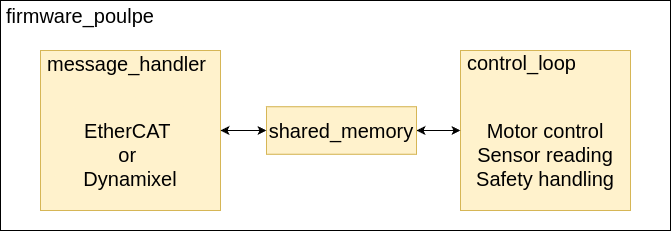

The firmware is composed into two real-time tasks that communicate through the `shared_memory` module. The two tasks are:

1) `control_loop` - responsible for the motor control and sensor reading  
    - inialization of the motor control and sensor reading
    - communication with the low-level TMC4671 actuators using SPI
    - reading the motor position sensors
    - reading the motor and board temperatures 
    - ensuring the safety of the motor by monitoring the temperatures, voltages low-level errors etc.

2) `message_handler` - responsible for the communication with the host computer either
    - using the serial communication and Dynamixel protocol - `dynamixel`
    - using EtherCAT protocol - `ethercat`
    - choosing the communication protocol is done using the `features` (either `ethercat` or `dynamixel`)


### Orbita2d architecture

<details>
<summary><b>Orbita2d beta</b></summary>
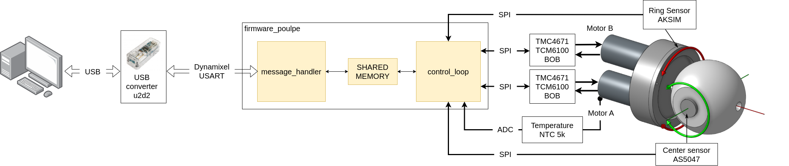
</details>

<details>
<summary><b>Orbita2d DVT</b></summary>
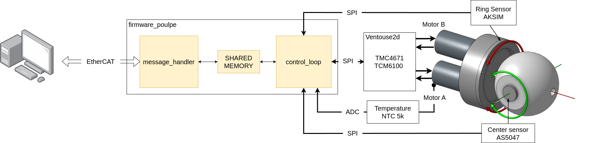
</details>
<details open>
<summary><b>Orbita2d PVT</b></summary>
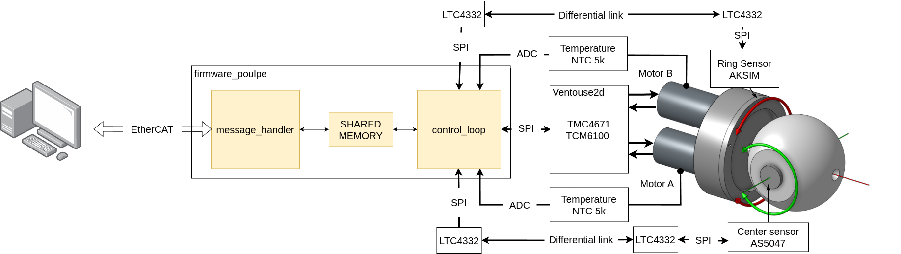
</details>

Orbita2d is a robotic actuator with two motors that use differential drive to run two axis. The motors used are maxon flat motors of Maxon `EC45` series. 
There are three differnet versions of the Orbita2d setup: beta, DVT and PVT. The main differences between the versions are the motor control board and the communication protocol used.

version | control board | driver control board | motor | communication | temperature sensing | axis sensor communication
----| ----| ----| ---- | ---- | ---- | ----
beta | poulpe | TMC4671 + TMC6100 BOB | EC45 flat | dynamixel | motor B | SPI
DVT | poulpe2d | ventouse2d | EC45 flat | EtherCAT | motor B | SPI
PVT | poulpe2d | ventouse2d | EC45 flat | EtherCAT | both motors | Differential I2C <br> LTC4332


### Orbita3d architecture

<details>
<summary><b>Orbita2d beta</b></summary>
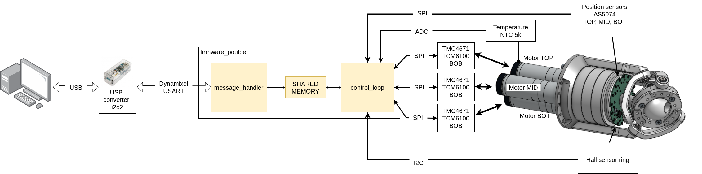
</details>

<details>
<summary><b>Orbita2d DVT</b></summary>
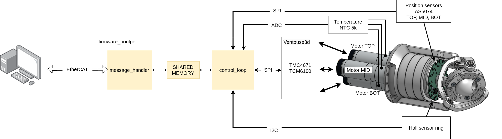
</details>
<details open>
<summary><b>Orbita2d PVT</b></summary>
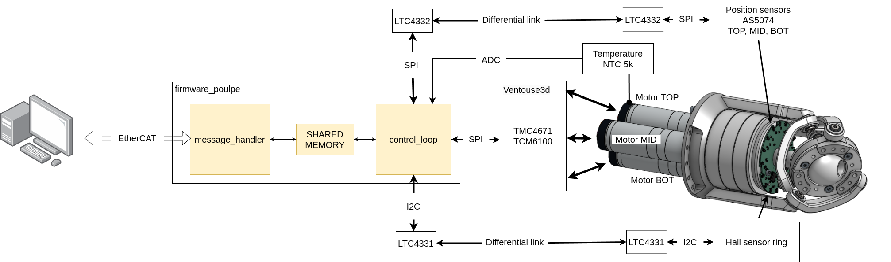
</details>

Orbita3d is a robotic actuator with three motors that use a parallel mechanical structure drive to run three axis. The motors used are maxon motors of the Maxon `ECX22` series. 
There are three differnet versions of the Orbita3d setup: beta, DVT and PVT.

version | control board | driver control board | motor | communication | temperature sensing | axis sensor communication 
----| ----| ----| ---- | ---- | ---- | ----
beta | poulpe | TMC4671 + TMC6100 BOB | ECX22 M | dynamixel | motor TOP | SPI, I2C
DVT | poulpe3d | ventouse3d | ECX22 M | EtherCAT | motor TOP | SPI, I2C
PVT | poulpe3d | ventouse3d | ECX22 L | EtherCAT | all three motors | Differential link<br> LTC4332(SPI)<br>LTC4331(I2C)


## Firmware configuration
The same firmware can be configured to work with many different  Orbita2d and Orbita3d hardware setups from which the most important are the beta, DVT and PVT versions. The configutation can be done using the `Cargo.toml` file and the command line arguments `--featatures`.


### Main features

Version | orbita2d | orbita3d | Communication | Hardware
----| ----| ----| ---- | ----
BETA | `orbita2d_beta` | `orbita3d_beta` |  dynamixel | [Poulpe](https://github.com/pollen-robotics/elec_Poulpe) + [Sponge](https://github.com/pollen-robotics/elec_Sponge) + [TMC4671+TMC6100 BOB](https://www.analog.com/en/resources/evaluation-hardware-and-software/evaluation-boards-kits/tmc4671-tmc6100-bob.html)
DVT | `orbita2d_gamma` | `orbita3d_gamma` | EtherCAT | [Poulpe 2d](https://github.com/pollen-robotics/elec_Poulpe_2d)  + [Ventouse 2d](https://github.com/pollen-robotics/elec_Ventouse_2d) or [Poulpe 3d ](https://github.com/pollen-robotics/elec_Poulpe_3d) + [Ventouse 3d](https://github.com/pollen-robotics/elec_Ventouse_3d)
PVT | `orbita2d_pvt` | `orbita3d_pvt` | EtherCAT | [Poulpe 2d](https://github.com/pollen-robotics/elec_Poulpe_2d)  + [Ventouse 2d](https://github.com/pollen-robotics/elec_Ventouse_2d) or [Poulpe 3d ](https://github.com/pollen-robotics/elec_Poulpe_3d) + [Ventouse 3d](https://github.com/pollen-robotics/elec_Ventouse_3d)

### All features

Orbita2d and Orbita3d setups can be configured using the following features (one of them has to be set):
- `orbita2d` - Orbita2d actuator setup  - [github page](https://github.com/pollen-robotics/orbita2d_control)
- `orbita3d` - Orbita3d actuator setup - [github page](https://github.com/pollen-robotics/orbita3d_control)

<b> Electronics version </b>
The electronics version determins the motor control board used and the communication protocols to the sensors
- `beta` - beta electronics version
- `gamma` - DVT electronics version
- `pvt` - PVT electronics version
> One them has to be set

<b> Motor version </b>
The motor version determins the gearing ratio and motor parameters used in the fimrware for the motor control
- `ec60` - EC60 flat maxon motor used - [datasheet](https://www.maxongroup.net.au/maxon/view/product/motor/ecmotor/ecflat/ecflat60/645604)
- `ec45` - EC45 flat maxon motor used - [datasheet](https://www.maxongroup.fr/medias/sys_master/root/8882563907614/EN-21-300.pdf)
- `ecx22` - ECX22 maxon motor used - [datasheet](https://www.maxongroup.com/maxon/view/product/motor/ecmotor/ECX/ECX22/ECXI22M4ZF46C4IL1Y501A)
> One them has to be set


<b> Communication configuration features </b>

There are two supported communication protocoles and each can be enabled using its dedicated feature
- `ethercat` - EtherCAT communication
- `dynamixel` - dynamixel communication 
> One them has to be set

They cannot be used both at the same time. At least one of them has to be used in order to be able to talk to the poulpe board.

<b>Advanced control features</b>
These features are used to configure the advanced control features in order to improve the motor control performance
- `cmd_filter` - Filter received position commands to reduce the jerk of the motor
- `velocity_feedforward` - Enable the use of the velocity feedforward to improve the velocity tracking performance 
    - has to be used in conjunction with the appropriate dynamixel message
    - using this feature will not change the default behavior of the firmware
- `allow_mode_change` - Allow the mode change of the motor control. Default mode is the position mode, and if this feature is enabled the motor can be switched to the velocity mode or to torque mode


<b>Actuator output features</b>
These features are used to decide which output angle of the motor to control
- `gearbox_output` - Control the motor angle after the gearbox
- `axis_output` - Control the motor angle after the gearbox and axis reduction

<b>Safety features</b>
Used to configure the safety features of the board
- `no_temperature_sensor` - The board does not have a temperature sensor, avoid reading it and using it for safety
- `ignore_errors` - Ignore the safety errors and continue the operation
- `allow_quickstop` - Allow the quickstop state of the actuator, a software emergency stop

<b>Flash memory features</b>
Used to enable/disable the usage of the flash memory
- `use_flash` - Enable the usage of the flash memory
- `write_flash` - Write the configuration to the flash memory (if not used the configuration will be read from flash - if available)

<b>Debugging features</b>
Used to enable the debugging features
- `debug_execution_time` - Measure and display the execution time of the real-time tasks

### Axis absolute zeros configuration

In order to use the absolute zero position of the actuators the absolute zero values need to be writen to the flash memory of the poulpe boards. These values are written to the memory once and are used on the boot of the board. The absolute zeros can be set using the `ZEROS` command line argument. The values are written to the flash memory using the `write_flash` feature.

The orbita2d and 3d actuators have dedicated absolute sensors for each axis that are used for their positioning. In order to provide the firmware with the mechanical zero position of the actuators, the axis sensors' position at the mechanical zero position has to be set. 
These values are written to the FLASH memory and require to be set only once. 

There are couple of ways to set the axis zeros:

- Directly from the terminal to the firmware using the `ZEROS` command line argument (in combination with `write_flash` feature)
- Using the provided binary files in the `src/bin` folder

#### Using the binary files

The binary files are specific to the actuator type
- `bench_Orbita2dWriteZeros.rs` - for the orbita2d actuator
- `bench_Orbita3dWriteZeros.rs` - for the orbita3d actuator

The binary files read the current axis positions and write them to the flash memory directly. No need to set the `ZEROS` command line argument. 

To write the zeros to the flash memory use the following command (example `PVT` version of the orbita2d)
```bash
cargo run --release -bin bench_Orbita2dWriteZeros --features orbita2d_pvt
```

Then just flash the firmware to the board and the zeros will be read from the flash memory on the next boot.

```bash
cargo run --release --features orbita2d_pvt
```

> IMPORTANT!
> The binary programs `bench_OrbitaXdWriteZeros` will write current axis sensor values as the axis zeros to the flash memory on each run. So make sure to run them only once and make sure to flash the firmware to the board right after the zeros are written to the flash memory. 


#### Using the command line arguments

- This way of flashing the axis zeros requires you to have determined the axis zero positions values determined in advance

- To write the configuration to the flash memory use the `write_flash` feature and set the command line arguments `ZEROS` to the desired values. The configuration will be written to the flash memory and will be read from it on the next boot. 

```bash
ZEROS=0.12,0.34,0.56 cargo run --release --features "orbita3d_xvz,write_flash"
```

- Once the configuration is written to the flash memory the `write_flash` feature can be removed as well as the command line arguments. The firmaware will automatically read the configuration from the flash memory on the next boot. 

```bash
cargo run --release --features orbita3d_xvz # the configuration will be read from the flash memory
```

- To reset the configuration in the flash memory use the `write_flash` feature and dont set any command line arguemnts. The configuration will be reset to the default values.

```bash
cargo run --release --features "orbitaNd_xvz,write_flash"
```

So here is an example suggested workflow:
1) Set the desired configuration using the command line arguments and the `write_flash` feature
```bash
ZEROS=0.12,0.34,0.56 cargo run --release --features "orbita3d_beta,write_flash"
```
2) Remove the `write_flash` feature and the command line arguments for any other upload of the firmware in the future
```bash
cargo run --release --features orbita3d_beta
```


### EtherCAT configuration 

Poulpe boards have to be configured as EtherCAT slaves in order to work with the EtherCAT master. The slave configuration is done using ESI XML files where the PDO, SDO and FoE protocols are defined. These files are compiled to the bunary format and written to the EEPROM memory of the LAN9252 chip, using the `ethercat` tool. The configuration is done only once and is stored in the EEPROM memory.
See a bit mode information in the [ethercat module](src/ethercat/README.md)


## Safety features

The firmware has implemented several safety features to ensure the safety of the motor and the user. The safety features are implemented in the `motor_control` module and are executed in the `control_loop` real-time task. The safety features are:
<b>Safe startup and checks</b>
- Check that the low-level drivers are working properly
- Check that the absolute sensors are working properly
- Check that the motor moves freely and is not blocked

Only if all the checks are passed the board will pass the initialization and will be ready to be switched on.

<b>Real-time safety monitoring</b>
- Motor temperature monitoring (high temperature warning at 65°C, high temperature error at 75°C)
- Board temperature monitoring (high temperature warning at 65°C, high temperature error at 75°C)
- Low-level driver failure monitoring
- Absolute sensor error monitoring
- Bus voltage monitoring (error under 10V)
- Low-level driver and sensor communication monitoring (error if the communication is lost for more thant 1s) 
- Over-temperature protection (not implemented yet)

The poulpe will stop disable the motors if any of the safety checks failed are triggered. 


## Firmware state machine

The state machine of the poulpe board is implemented in the `state_machine` module. The state machine is responsible for the initialization of the board and the safety features. The state machine follows the CiA 402 standard for the motor control. 

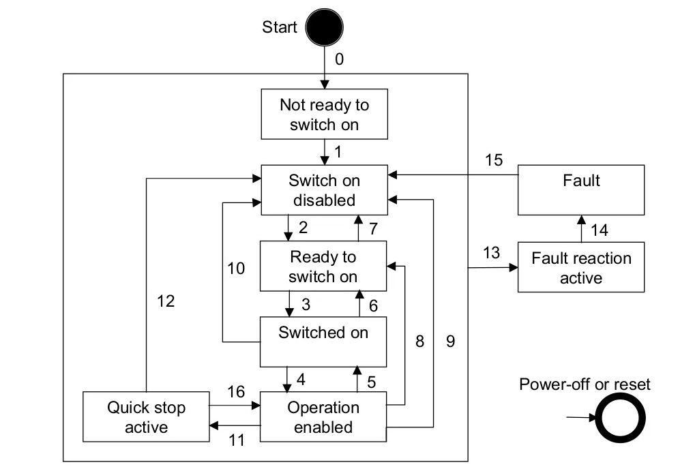

The state machine has the following states:
- `NotReadyToSwitchOn` - The board is performing the initialization
- `SwitchOnDisabled` - The init is done successfully and the board is disabled
- `ReadyToSwitchOn` - The board is ready to be switched on 
- `SwitchedOn` - The board is switched on
- `OperationEnabled` - The board is switched on and the actuators are enabled
- `QuickStopActive` - The board is responding to the quick stop command (emergency stop)
    - once the response is done the firmware goes to the `SwitchOnDisabled` state
- `FaultReactionActive` - The board is in the fault reaction state (one of the safety checks failed)
    - once the response is done the firmware goes to the `Fault` state
- `Fault` - The board is in the fault state (not recoverable error)

There is an additional warning flag that can be active if the board or motor temperatures are high, but still under the maximum allowed value. The warning flag is active in the `SwitchedOn` and `OperationEnabled` states.

Read more in the [state machine module](src/state_machine/README.md)


## LED blinking patterns

The blinking of the LED on the board is used to indicate the state of the board. There are two colors of the LED - green and red. The LED can be solid or blinking. The LED is blinking with a period of 500ms. The pattern of blinking is as follows:


 state           | CiA402 state | green         | red
 ----------------|--------------|---------------|---------
 init            | `NotReadyToSwitchOn`  | blinks        | blinks
 preop           |`SwitchOnDisabled`,`ReadyToSwitchOn`,`SwitchedOn` | solid         | off
 preop  + warning |`SwitchOnDisabled`,`ReadyToSwitchOn`,`SwitchedOn`| solid         | blinks
 op               |`OperationEnabled`| solid         | off
 op  + warning    |`OperationEnabled`| solid         | blinks
 fault            |`Fault`| off           | solid
 fault_reaction   |`FaultReactionActive`| off           | blinks
 quick_stop_reaction   |`QuickStopActive`| solid           | solid


## Related repositories

This firmware repo is closely related to different software and hardware repositories. 

### Firmware

- [bootloader_Poulpe](https://github.com/pollen-robotics/bootloader_Poulpe) - A bootloader for the Poulpe board

### Software

- [poulpe_ethercat_controller](https://github.com/pollen-robotics/poulpe_ethercat_controller) - The complete EtherCAT master stack for the Poulpe boards
- [orbita2d_control](https://github.com/pollen-robotics/orbita2d_control) - The orbita2d control software
- [orbita3d_control](https://github.com/pollen-robotics/orbita3d_control) - The orbita3d control software

The firmware implmenets the ethercat slave and the master is implemented in the `poulpe_ethercat_controller` repository. Therefore the compatibility between the firmware and the `poulpe_ethercat_controller` is important and is as follows:

`firmware_poulpe` version | `poulpe_ethercat_controller` version
----| ----
v0.9.0 | v0.9.0 or higher
v1.0.x | v1.0.x or higher
v1.5.x | v1.5.x

So in general, the `poulpe_ethercat_controller` version has to be the same or higher than the `firmware_poulpe` version. See  available `poulpe_ethercat_controller` releases [here](https://github.com/pollen-robotics/poulpe_ethercat_controller/releases). More details about the master-slave communicaiton protocol can be found in the ethercat crate [README.md](src/ethercat/README.md)

### Hardware

- [elec_Poulpe](https://github.com/pollen-robotics/elce_Poulpe) - The Poulpe board (`beta` version)
- [elec_Sponge](https://github.com/pollen-robotics/elec_Sponge) - The driver board (`beta` version)
- [elec_Poulpe_2d](https://github.com/pollen-robotics/elec_Poulpe_2d) - The Poulpe board for orbita2d (`DVT` and `PVT` versions)
- [elec_Ventouse_2d](https://github.com/pollen-robotics/elec_Ventouse_2d) - The Ventouse board for orbita2d (`DVT` and `PVT` versions)
- [elec_Poulpe_3d](https://github.com/pollen-robotics/elec_Poulpe_3d) - The Poulpe board for orbita3d (`DVT` and `PVT` versions)
- [elec_Ventouse_3d](https://github.com/pollen-robotics/elec_Ventouse_3d) - The Ventouse board for orbita3d (`DVT` and `PVT` versions)


## Future work and improvements

- Safety 
    - Make more accurate motor temperature reading
    - Add over-current protection
- Testing  - [initial developement](https://github.com/pollen-robotics/firmware_Poulpe/tree/feat_embedded_tests)
    - Add unit tests
    - Add integration tests
    - Add hardware tests

