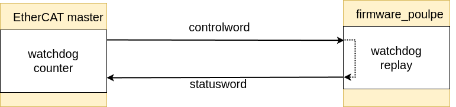

# EtherCAT module

This module contains the EtherCAT communication functions that are used in the project.

- `lan9252`: Contains the functions to communicate with the LAN9252 chip
- `task.rs`: Contains the task that implements the EtherCAT communication, sending and receiving data from the LAN9252 chip and updating the shared memory

# PDOs structure

The full CiA402 design specification can be found here: [dsp402.pdf](../../docs/dsp402.pdf)

Here is a summary of the commonly used PDO structures:
- RxPDOs: [some nice docs](https://doc.synapticon.com/node/sw5.1/object_dict/pdo/rxpdo.html)
- TxPDOs: [some nice docs](https://doc.synapticon.com/node/sw5.1/object_dict/pdo/txpdo.html?tocpath=Software%20Reference%205.1%7CProcess%20Data%20Objects%20(PDO)%7C_____2)

Here is the chosen structure of the PDOs. They now follow relatively well the CiA4 standard. 
The Indexes correspond to the indexes in the standard and the sub-indexes correspond to the axis of the actuaror 2 axis for orbita2d and 3 axis for orbita 3d.

- `OrbitaIn` (RxPdo) - Master to Slave
- `OrbitaState` (TxPdo) - Slave to Master
- `OrbitaOut` (TxPdo) - Slave to Master

| Attribute | `OrbitaIn` (RxPdo) | `OrbitaState` (TxPdo) | `OrbitaOut` (TxPdo)
| --- | --- | --- | --- |
| `sm_type` | BUFFERED | MAILBOX |  BUFFERED |
| `address` | 1000 | 1200 | 1300 | 
| `name` | `OrbitaIn` |  `OrbitaState` |  `OrbitaOut` |
| **write frequency** | 1kHz | 10Hz |  1kHz |
| **orbita2d size** | 43 Bytes | 31 Bytes | 27 Bytes |
| **orbita3d size** | 63 Bytes | 45 Bytes | 39 Bytes |

**Some important notes** 
- LAN9252 limits the number of PDO objects supported to 4, so we could potentially add one more PDO object to the list.
- LAN9252 limits the number of bytes that can be written to its memory at once to 64 bytes (otherwise we need to write the data in 64B chunks). This is why the size of the PDOs is important and they are all under 64 bytes.
- Therea are two types of Sync Managers (`sm_type`) used with the firmware for EtherCAT communiction: `BUFFERED` and `MAILBOX`. The `BUFFERED` type is used for the `OrbitaIn` PDOs, because we want to send the data as fast as possible. The `MAILBOX` type is used for the `OrbitaState` and `OrbitaOut` PDOs, because we want to send the data at a slower rate. `BUFFERED` type buffers the data in the master and we do not see any potential data loss if the slave is not able to read/write the data in time. 
`MAILBOX` type uses a handshake mechanism to ensure that the data is received by the master and is mostly used for punctual data that is not time sensitive.

### OrbitaIn (RxPdo)  - Master to Slave

| Entry Name | Entry Type | Index | Sub-Index | 
| --- | --- | --- | --- |
| controlword | UINT16 | 0x6041 | - |
| mode_of_operation | UINT8 | 0x6060 | - |
| target_position | REAL | 0x607A | 1, 2, ... (up to orbita_type) |
| target_velocity | REAL | 0x60FF | 1, 2, ... (up to orbita_type) |
| velocity_limit | REAL | 0x607F | 1, 2, ... (up to orbita_type) |
| target_torque | REAL | 0x6071 | 1, 2, ... (up to orbita_type) |
| torque_limit | REAL | 0x6072 | 1, 2, ... (up to orbita_type) |

### OrbitaState (TxPdo)  - Slave to Master

| Entry Name | Entry Type | Index | Sub-Index |
| --- | --- | --- | --- |
| error_code | UINT16 | 0x603F | 0 (homing), 1,2, .. (up to orbita_type) |
| actuator_type | UINT8 | 0x6402 | - |
| axis_position_zero_offset | REAL | 0x607C | 1, 2, ... (up to orbita_type) |
| board_temperatures | REAL | 0x6500 | 1, 2, ... (up to orbita_type) |
| motor_temperatures | REAL | 0x6501 | 1, 2, ... (up to orbita_type) |

### OrbitaOut (TxPdo) - Slave to Master

| Entry Name | Entry Type | Index | Sub-Index |
| --- | --- | --- | --- |
| statusword | UINT16 | 0x6040 | - |
| mode_of_operation_display | UINT8 | 0x6061 | - |
| actual_position | REAL | 0x6064 | 1, 2, ... (up to orbita_type) |
| actual_velocity | REAL | 0x606C | 1, 2, ... (up to orbita_type) |
| actual_torque | REAL | 0x6077 | 1, 2, ... (up to orbita_type) |
| actual_axis_position | REAL | 0x6063 | 1, 2, ... (up to orbita_type) |

## Watchdog implmenetation

As we are using the LAN9252 which buffers the data in the master, we need to implement a watchdog mechanism to ensure that the data has been sent from the master, and that we are not reading old data, as well as to ensure that the slave is still alive. The watchdog mechanism is implemented in the `task.rs` file. 

The watchdog is implemented as a 3 bit counter that is received from the master and replayed by the slave. The master increments the counter every time it sends the data and the slave replays the counter every time it sends the data to the master. This way if the counter is not incremented by the master, the slave will know that the master is not sending the data and will stop the actuators. If the counter is not replayed by the slave the master will know that the slave is not sending the data and will stop the actuators.

The watchdog is impmented using the `controlword` and `statusword` PDO entries. The `controlword` is used to send the counter from the master to the slave and the `statusword` is used to send the counter from the slave to the master. Each of these PDO entries has some manufacturer specific bits that we can use, and in this case we are using 
- `controlword` bits 11-13 to send the counter from the master to the slave
- `statusword` bits 8, 15 and 15 to send the counter from the slave to the master

The watchdog mechanism is implemented in the `task.rs` file. 

### Watchdog counter stop behavior

If the watchdog counter is not incremented by the maste any more, this means that the connection is lost and the actuators should be stopped for more than 100ms. The CiA402 `QuickStop` command is emitted and the firmware goes to the `SwitchOnDisabled` state. If the state was `OperationEnabled` the turning off is done in a controller manner through `QuickStopActive` state. See more info in the state machine module [here](../state_machine/README.md).