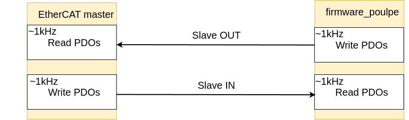
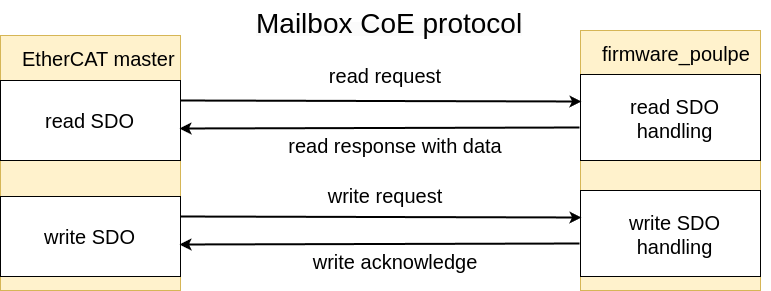
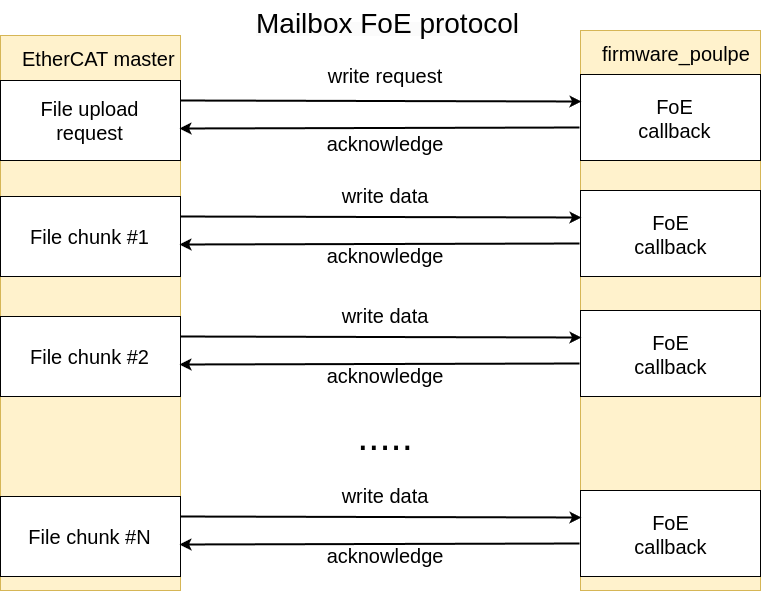

# EtherCAT module

This module contains the EtherCAT communication functions that are used in the project.

- `lan9252`: Contains the functions to communicate with the LAN9252 chip
- `task.rs`: Contains the task that implements the EtherCAT communication, sending and receiving data from the LAN9252 chip and updating the shared memory


See [these docs](https://pollen-robotics.github.io/poulpe_ethercat_controller/ethercat/) to have a bit more info about ethercat communication protocols.

### Table of Contents:
- [Slave Information ESI structure](#slave-information-esi-structure)
    - [PDOs structure](#pdos-structure)
        - [PDO Watchdog implmenetation](#pdo-watchdog-implmenetation)
    - [Mailbox communication](#mailbox-communication)
        - [SDO communication](#sdo-communication)
        - [FoE communication](#foe-communication)

- [Configuring the poulpe board as an EtherCAT slave](#configuring-the-poulpe-board-as-an-ethercat-slave)

##  Slave Information ESI structure

-  LAN9252 limits the number of Sync managers supported to 4, so as we now support FoE and CoE for SDO we need all of them: 2 for the PDOs and 2 for the SDOs

Sync manager | Type | Address | Name | Frequency | Size | Description
--- | --- | --- | --- | --- | --- | ---
`0` | `MAILBOX` | 0x1000 | `MBXOut` | - | 128B | SDO and FoE request
`1` | `MAILBOX` | 0x1180 | `MBXIn` | - | 128B | SDO and FoE respense
`2` | `BUFFERED` | 0x1300 | `OrbitaIn` | 1kHz | - | Orbita PDO outputs at 1kHz
`3` | `BUFFERED` | 0x1400 | `OrbitaOut` | 1kHz | - | Orbita PDO inputs at 1kHz

- Therea are two types of Sync Managers available for EtherCAT communiction: `BUFFERED` and `MAILBOX`. 
    - The `BUFFERED` type is used for the `OrbitaIn`, `OrbitaState` and `OrbitaOut` PDOs, because we want to send the data as fast as possible (at 1kHz).`BUFFERED` type buffers the data in the master and we do not see any potential data loss if the slave is not able to read/write the data in time. 
    - The `MAILBOX` type is used for the ansyn data exchange with request/response mechanism handskahe confirmation. 
        - It cannot be used in runtime (only when the LAN9252 is in the `PREOP` state)
        - It is used for SDO communcation
        - It is used to FoE firmware update


## PDOs structure




The full CiA402 design specification can be found here: [dsp402.pdf](../../docs/images/dsp402.pdf)

Here is a summary of the commonly used PDO structures:
- RxPDOs: [some nice docs](https://doc.synapticon.com/node/sw5.1/object_dict/pdo/rxpdo.html)
- TxPDOs: [some nice docs](https://doc.synapticon.com/node/sw5.1/object_dict/pdo/txpdo.html?tocpath=Software%20Reference%205.1%7CProcess%20Data%20Objects%20(PDO)%7C_____2)

Here is the chosen structure of the PDOs. They now follow relatively well the CiA4 standard. 
The Indexes correspond to the indexes in the standard and the sub-indexes correspond to the axis of the actuaror 2 axis for orbita2d and 3 axis for orbita 3d.

- `OrbitaIn` (RxPdo) - Master to Slave
- `OrbitaState` (TxPdo) - Slave to Master
- `OrbitaOut` (TxPdo) - Slave to Master


| Attribute | `OrbitaIn` (RxPdo) | `OrbitaState` (TxPdo) | `OrbitaOut` (TxPdo)
| --- | --- | --- | --- |
| `sm_type` | BUFFERED | BUFFERED |  BUFFERED |
| `sync manager` | `2` | `3` | `3`
| `address` | 1000 | 1200 | 1300 | 
| `name` | `OrbitaIn` |  `OrbitaState` |  `OrbitaOut` |
| **write frequency** | 1kHz | 1kHz |  1kHz |
| **orbita2d size** | 43 Bytes | 31 Bytes | 27 Bytes |
| **orbita3d size** | 63 Bytes | 45 Bytes | 39 Bytes |

**Some important notes** 
- LAN9252 limits the number of Sync managers supported to 4, so as we now support FoE and CoE for SDO we need all of them: 2 for the PDOs and 2 for the SDOs
- So both output PDOs are using the same Sync manager `3` and the input PDOs are using the Sync manager `2`

### OrbitaIn (RxPdo)  - Master to Slave

| Entry Name | Entry Type | Index | Sub-Index | 
| --- | --- | --- | --- |
| controlword | UINT16 | 0x6041 | - |
| mode_of_operation | UINT8 | 0x6060 | - |
| target_position | REAL | 0x607A | 1, 2, ... (up to orbita_type) |
| target_velocity | REAL | 0x60FF | 1, 2, ... (up to orbita_type) |
| velocity_limit | REAL | 0x607F | 1, 2, ... (up to orbita_type) |
| target_torque | REAL | 0x6071 | 1, 2, ... (up to orbita_type) |
| torque_limit | REAL | 0x6072 | 1, 2, ... (up to orbita_type) |

### OrbitaState (TxPdo)  - Slave to Master

| Entry Name | Entry Type | Index | Sub-Index |
| --- | --- | --- | --- |
| error_code | UINT16 | 0x603F | 0 (homing), 1,2, .. (up to orbita_type) |
| actuator_type | UINT8 | 0x6402 | - |
| axis_position_zero_offset | REAL | 0x607C | 1, 2, ... (up to orbita_type) |
| board_temperatures | REAL | 0x6500 | 1, 2, ... (up to orbita_type) |
| motor_temperatures | REAL | 0x6501 | 1, 2, ... (up to orbita_type) |

### OrbitaOut (TxPdo) - Slave to Master


| Entry Name | Entry Type | Index | Sub-Index |
| --- | --- | --- | --- |
| statusword | UINT16 | 0x6040 | - |
| mode_of_operation_display | UINT8 | 0x6061 | - |
| actual_position | REAL | 0x6064 | 1, 2, ... (up to orbita_type) |
| actual_velocity | REAL | 0x606C | 1, 2, ... (up to orbita_type) |
| actual_torque | REAL | 0x6077 | 1, 2, ... (up to orbita_type) |
| actual_axis_position | REAL | 0x6063 | 1, 2, ... (up to orbita_type) |

### PDO Watchdog implmenetation

As we are using the LAN9252 which buffers the data in the master, we need to implement a watchdog mechanism to ensure that the data has been sent from the master, and that we are not reading old data, as well as to ensure that the slave is still alive. The watchdog mechanism is implemented in the `task.rs` file. 

The watchdog is implemented as a 3 bit counter that is received from the master and replayed by the slave. The master increments the counter every time it sends the data and the slave replays the counter every time it sends the data to the master. This way if the counter is not incremented by the master, the slave will know that the master is not sending the data and will stop the actuators. If the counter is not replayed by the slave the master will know that the slave is not sending the data and will stop the actuators.

The watchdog is impmented using the `controlword` and `statusword` PDO entries. The `controlword` is used to send the counter from the master to the slave and the `statusword` is used to send the counter from the slave to the master. Each of these PDO entries has some manufacturer specific bits that we can use, and in this case we are using 
- `controlword` bits 11-13 to send the counter from the master to the slave
- `statusword` bits 8, 15 and 15 to send the counter from the slave to the master

The watchdog mechanism is implemented in the `task.rs` file. 


**Watchdog counter stop behavior**

If the watchdog counter is not incremented by the maste any more, this means that the connection is lost and the actuators should be stopped for more than 100ms. The CiA402 `QuickStop` command is emitted and the firmware goes to the `SwitchOnDisabled` state. If the state was `OperationEnabled` the turning off is done in a controller manner through `QuickStopActive` state. See more info in the state machine module [here](../state_machine/README.md).

## Mailbox communication

The mailbox communication is used for the SDO and FoE communication.
The mailbox protocol is implemented in `mailbox.rs` file and CoE and FoE communication is implemented in the `coe.rs` and `foe.rs` files respectively.

Mailbox communication is intended for configuration and non-real-time data exchange, so it is only available in the lan9252's `PREOP` state.

### SDO communication

SDO communuication is implemented using the Can Over Ethercat (CoE) protocol. The CoE protocol is used to read and write the object dictionary entries of the slave and it is implemented in the `coe.rs` file. 



CoE allows to read and write the SDO objects in the firmware that are addressed using the `index` and `subindex`. 

Currently implemented SDO objects are:

Index | Subindex | Description | Type | Read/Write
--- | --- | --- | --- | ---
0x100 | 1 | Number of firmware bytes received (FoE protocol) | UINT32 | RW
0x200 | 1 | Current git hash of the firmware in the device | String | R
0x201 | 1 | Current Dynamixel ID | UINT8 | R
0x202 | x | Hardware zeros (sub-index corresponds to axis) | FLOAT| R
0x203 | 1 | Axis number of the slave | UINT32| R

The SDO communication is implemented in the `task.rs` file.

You can read the SDO objects from the terminal using the `ethercat upload` function. 

```bash
$ ethercat upload -p0 0x200 1 -t string # read the Git hash
c9ab43abdac3c5a914a9c19bfc0df489f20add2f
$ ethercat upload -p0 0x203 1 -t uint32 # read the axis number
0x00000003 3
$ ethercat upload -p0 0x100 1 -t uint32 # read the number of firmware bytes received
0x00000000 0
```

For writing the SDO objects you can use the `ethercat download` function. 

```bash
$ ethercat download -p0 0x100 1 -t uint8 255 # write the number of firmware bytes received 
```


### FoE communication

FoE communication is implemented using the File Over Ethercat (FoE) protocol. The FoE protocol is used to update the firmware of the slave and it is implemented in the `foe.rs` file. 



The FoE protocol is implemented unidirectionally from the master to the slave, and is intended for firmware updates. The master sends the firmware file to the slave and the slave writes the firmware to the flash memory. Once the firmware is received the master sends the command to the slave to reboot and the slave reboots with the new firmware.

<details markdow="1"><summary> Getting the firmware in .bin format </summary>

First build the firmware with for the actuator version that you want to update. 

```bash
$ DEFMT_LOG=off cargo build --release --features orbita2d_pvt
```

Then run the `extract_hex` script to extract the firmware from the ELF file. 

```bash
$ sh extract_hex.sh
Bin file generated: firmware.bin
```

You can check the size of the firmware file using the `ls` command. 

```bash
$ ls -l firmware.bin
-rw-r--r-- 1 user user 22152 Sep  7 14:00 firmware.bin
```

</details>

You can write the firmware to the slave using the `ethercat fow_write` function. 

```bash
$ ethercat foe_write -p0 firmware.bin --verbose
Read 22152 bytes of FoE data.
FoE writing finished.
```

You can read the no bytes received by the firmware using the `ethercat upload` function. 

```bash
$ ethercat upload -p0 0x100 1 -t uint32 # read the number of firmware bytes received
0x00005688 22152
```

To reset the firmware and confirm the firmware update you have to send the exact number of bytes that you have sent to the slave to the address `0x100` and subindex `1`. 

```bash
$ ethercat download -p0 0x100 1 -t uint32 22152 # write the number of firmware bytes received 
```

After that the slave will reboot with the new firmware.

## Configuring the poulpe board as an EtherCAT slave

The poulpe board is configured as an EtherCAT slave using the `ethercat` tool. The configuration is done by flashing the EEPROM of the LAN9252 chip with the configuration files are stored in the `poulpe_ethetcat_controller` repository in the `config` folder. See is [on github](https://github.com/pollen-robotics/poulpe_ethercat_controller/tree/develop/config/esi/reachy2/).

There are two families of configuration files that are slightly different for the firmware version that you are using.
- firmware 1.0.x - [github](https://github.com/pollen-robotics/poulpe_ethercat_controller/tree/develop/config/esi/reachy2/firmware1.0).
- firmware 1.5.x - [github](https://github.com/pollen-robotics/poulpe_ethercat_controller/tree/develop/config/esi/reachy2/firmware1.5).

So you have to choose the correct configuration file for the firmware version that you want to flash.

Once you have identified your firmware version and you download the correct configuration file you can flash the EEPROM of the LAN9252 chip using the `ethercat` tool. 

```bash
ethercat sii_write -p0 LeftWristOrbita3d.bin # slave 0 configured as a left writst 
```

In order for the change to take place you have to disconnect the poulpe board from the power supply and reconnect it. Then if you check it's slave information you should see the new configuration. 

```
$ ethercat slaves
0  0:0  PREOP  +  LeftWristOrbita3d
```

You can also check its full list of PDOs and SDOs using the `ethercat pdos` function. 

```
$ ethercat pdos -p0
```

<details markdown="1"><summary> Example output </summary>

```bash
$ ethercat pdos -p0
SM0: PhysAddr 0x1000, DefaultSize  128, ControlRegister 0x26, Enable 1
SM1: PhysAddr 0x1180, DefaultSize  128, ControlRegister 0x22, Enable 1
SM2: PhysAddr 0x1300, DefaultSize    0, ControlRegister 0x64, Enable 1
  RxPDO 0x1600 "OrbitaIn"
    PDO entry 0x6041:00, 16 bit, "controlword"
    PDO entry 0x6060:00,  8 bit, "mode_of_operation"
    PDO entry 0x607a:01, 32 bit, "target_position"
    PDO entry 0x607a:02, 32 bit, "target_position"
    PDO entry 0x607a:03, 32 bit, "target_position"
    PDO entry 0x60ff:01, 32 bit, "target_velocity"
    PDO entry 0x60ff:02, 32 bit, "target_velocity"
    PDO entry 0x60ff:03, 32 bit, "target_velocity"
    PDO entry 0x607f:01, 32 bit, "velocity_limit"
    PDO entry 0x607f:02, 32 bit, "velocity_limit"
    PDO entry 0x607f:03, 32 bit, "velocity_limit"
    PDO entry 0x6071:01, 32 bit, "target_torque"
    PDO entry 0x6071:02, 32 bit, "target_torque"
    PDO entry 0x6071:03, 32 bit, "target_torque"
    PDO entry 0x6072:01, 32 bit, "torque_limit"
    PDO entry 0x6072:02, 32 bit, "torque_limit"
    PDO entry 0x6072:03, 32 bit, "torque_limit"
SM3: PhysAddr 0x1400, DefaultSize    0, ControlRegister 0x20, Enable 1
  TxPDO 0x1700 "OrbitaOut"
    PDO entry 0x6040:00, 16 bit, "statusword"
    PDO entry 0x6061:00,  8 bit, "mode_of_operation_display"
    PDO entry 0x6064:01, 32 bit, "actual_position"
    PDO entry 0x6064:02, 32 bit, "actual_position"
    PDO entry 0x6064:03, 32 bit, "actual_position"
    PDO entry 0x606c:01, 32 bit, "actual_velocity"
    PDO entry 0x606c:02, 32 bit, "actual_velocity"
    PDO entry 0x606c:03, 32 bit, "actual_velocity"
    PDO entry 0x6077:01, 32 bit, "actual_torque"
    PDO entry 0x6077:02, 32 bit, "actual_torque"
    PDO entry 0x6077:03, 32 bit, "actual_torque"
    PDO entry 0x6063:01, 32 bit, "actual_axis_position"
    PDO entry 0x6063:02, 32 bit, "actual_axis_position"
    PDO entry 0x6063:03, 32 bit, "actual_axis_position"
  TxPDO 0x1800 "OrbitaState"
    PDO entry 0x603f:00, 16 bit, "error_code"
    PDO entry 0x603f:01, 16 bit, "error_code"
    PDO entry 0x603f:02, 16 bit, "error_code"
    PDO entry 0x603f:03, 16 bit, "error_code"
    PDO entry 0x6402:00,  8 bit, "actuator_type"
    PDO entry 0x607c:01, 32 bit, "axis_position_zero_offset"
    PDO entry 0x607c:02, 32 bit, "axis_position_zero_offset"
    PDO entry 0x607c:03, 32 bit, "axis_position_zero_offset"
    PDO entry 0x6500:01, 32 bit, "board_temperatures"
    PDO entry 0x6500:02, 32 bit, "board_temperatures"
    PDO entry 0x6500:03, 32 bit, "board_temperatures"
    PDO entry 0x6501:01, 32 bit, "motor_temperatures"
    PDO entry 0x6501:02, 32 bit, "motor_temperatures"
    PDO entry 0x6501:03, 32 bit, "motor_temperatures"
```

</details>