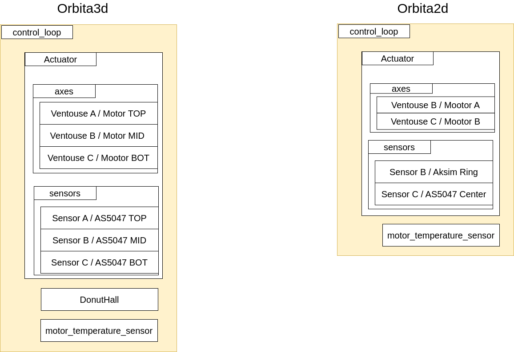
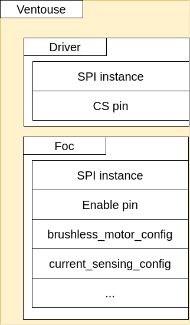

# Motor control crate

This crate provides a simple interface to control the motors of the robot. It is based on the `embassy` crate its primary role is to server as:

- Communication layer with the low-level hardware
    - TMC4671 all-in-one foc motor controller - SPI communication
        - Configure the motor controller
        - Read the motor controller status
        - Set the target positon, velocity, and torque
        - Read the actual position, velocity, and torque
        - Configure its internal PID controller
    - AS5057 magnetic encoder - SPI communication
    - RLS magnetic encoder - SPI communication
    - Hall sensor array - I2C communication
    - All these values are read and written to the `SHARED_MEMORY` struct buffer
- Ensure the safety of the actuator by monitoring its operation in real-time
    - Failsafe initialization
    - Real-time opearation monitoring
        - Overtemperature protection (both for the motors and boards)
        - Overcurrent protection (in developement)
        - Undervoletage protection
    - Keeping track of the internal state of board using the `BoardState` struct

The crates main module is the `task` module that implements the real-time embasy-rs task that runs at the frequency of 1kHz. 
The task is responsible for reading the sensor values, calculating the control signals, and writing the control signals to the motor controller. The task also monitors the operation of the motor controller and the board and ensures the safety of the actuator.

## Taks flow

The task flow is as follows:
1) Fail-safe initialization
    - Configure the motor controller to the default values 
        - on fail `BoardState::InitError`
    - Perform the motor alignement 
        - on fail `BoardState::InitError`
    - Make a small movement to ensure that both the motor and sensors are working 
        - on fail `BoardState::SensorError`
    - If orbita3d and `ZEROS` are available perform the homing search procedure 
        -on fail `BoardState::ZeroingError` or `BoardState::IndexError`
    - Disable the motor controller
    > If anly of the seteps fails the procedure is restarted once, if it fails again the motor controller is disabled permanently with the appropriate error message
2) Real-time operation
    - 1kHz task:
        - Veryfy the board state
            - if intialization error prevent actuator enable
            - if error state from real-time operation prevent stop the actuator gracefully
        - Write the TM4671
            - Write the torque enable/disable
            - Write the target position 
            - Write the torque/velocity limits
        - Read the TM4671
            - Read the actual position
            - Read the actual torque
            - Read the actual velocity
        - Read the absolute sensors
            - Read the AS5047 
            - Read the RLS (if orbita 2d) 
    - 1Hz task:
        - Write the TM4671
            - Write the PID controller values
        - Read the TM4671
            - Read the board temperature
        - Read the motor temperature for the Pouple ADC
        - Perform the safety checks
            - Overtemperature protection
            - Overcurrent protection
            - Undervoltage protection
            - Update the board state
        
## Board state

The motor control crate uses the `BoardState` struct to keep track of the internal state of the board. The board state is updated in real-time and is used to determine its safety status. The board state can be one of the following:

<b>Normal operation</b>
- `Ok` - The board is operating normally
- `HighTemperatureState` - The board is overheating, but not yet in a critical state
     - This state will return to `Ok` once the temperature drops below the threshold
     - Treshold is set to `65C` by default in the `config` crate

<b>Initialisation errors</b>
- `InitError` - The board failed to initialize
- `SensorError` - The board failed to read the sensor values
- `ZeroingError` - The board failed to perform the homing search procedure
- `IndexError` - The board failed to perform the homing search procedure

<b>Real-time operation errors</b>
- `OverTemperatureError` - The board or the motor is overheating
     - Treshold is set to `75C` by default in the `config` crate
- `OverCurrentError` - The board is drawing too much current (not yet implemented)
- `BusVoltageError` - The board's power supply voltage is too low
     - Treshold is set to `10V`
- `UnknownError` - An unknown error occurred

## Software architecture

The motor control crate is designed to be as modular as possible. 

The orbita actuators is implmented using the `Actuator` structure that has either 2 or 3 motors. The `Actuator` structure is as shown on the image below.

The `Actuator` structure maintains the array of 2 or 3 motor 
drivers, that are instances of the `Ventouse` structure and 2 or 3 sensors that implemnet `Sensor` trait. Addiitonally, the `Actuator` maintains an insatnce of `Analog` structure that is used to read the motor temperature. In case of the orbita3d, it contains the  `I2cHallSensor` structure called `DonutHall` that is used to read the hall sensor array. 
The `Ventouse` structure is as shown on the image below.

The `Driver` structure implment the necessary steps to read and write the registers to the TMC6200 and `Foc` structure implemnets the necessary steps to read and write the registers to the TMC4671. 
Both of them use the `Spi` structure to communicate with the boards. 

The `Sensor` trait is implemented by the `AD5047Sensor` and `AksimSensor` structures that read the AS5047 and RLS sensors respectively using SPI communication. Addiitonally, the `I2cHallSensor` structure is used to read the hall sensor array using I2C communication.

